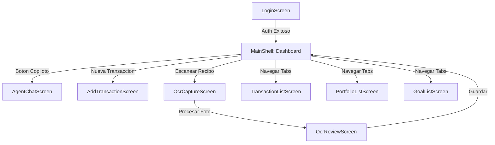

# Copiloto Financiero — Documento de Diseño e Interfaz (UI/UX)

Este documento define el sistema de diseño, los tokens visuales, los componentes globales y la especificación detallada de cada pantalla del proyecto **Copiloto Financiero**, estructurado para facilitar la interpretación y maquetación en el ecosistema de desarrollo.

---

## 1. Design System & Tokens

### Paleta de Colores
Diseñada con una estética financiera premium que combina la seriedad de una herramienta financiera clásica con la dinamismo de los videojuegos de rol (RPG).

| Token | Nombre | Valor Hex | Uso Principal |
|---|---|---|---|
| `color-primary` | Emerald Green | `#1A6D54` | Botones principales, branding, títulos primarios, estados activos. |
| `color-secondary`| Forest Deep | `#0F3227` | Fondos con gradientes, acentos visuales y barras secundarias. |
| `color-background`| Pure Dark / Light | `#0B1412` (Oscuro) `#F4FBF7` (Claro) | Fondo general de la aplicación. |
| `color-surface` | Elevated Surface | `#152420` (Oscuro) `#FFFFFF` (Claro) | Tarjetas, modales de formulario y bloques contenedores. |
| `color-text-main` | High Contrast Text| `#FFFFFF` (Oscuro) `#1A2421` (Claro) | Títulos principales e información esencial. |
| `color-text-mut` | Muted Text | `#8C9D98` (Oscuro) `#5B6C67` (Claro) | Textos de apoyo, etiquetas secundarias e iconos inactivos. |
| `color-accent-game`| Boss/Action Red | `#BA1A1A` | Barra de vida del Jefe Final, alertas, gastos y balances negativos. |
| `color-accent-win` | Success Green | `#37E696` | ROI positivo, metas completadas e ingresos. |

### Tipografía
Tipografía limpia y de alta legibilidad, utilizando **Outfit** o **Inter** como fuentes principales.

*   **Display / Ranks (`font-display`):** Bold u ExtraBold. Para niveles y el "Jefe Final".
*   **Headline (`font-head`):** SemiBold. Títulos de secciones principales (ej. balance, carteras).
*   **Body (`font-body`):** Regular o Medium. Lectura de transacciones e interacciones en el chat.

| Nivel | Tamaño | Peso (Weight) | Uso de Ejemplo |
|---|---|---|---|
| `font-size-xxl` | `32sp` | Bold (700) | Balance principal, número de nivel. |
| `font-size-xl` | `24sp` | SemiBold (600) | Títulos de pantalla, "Jefe Final". |
| `font-size-lg` | `18sp` | Medium (500) | Nombres de carteras y tarjetas. |
| `font-size-md` | `14sp` | Regular (400) | Textos de transacciones, inputs. |
| `font-size-sm` | `12sp` | Medium (500) | Rango de usuario, etiquetas secundarias. |

### Espaciados & Bordes (Grid System)
Basado en una rejilla con incrementos de 4px para asegurar uniformidad.

*   **Padding Base:** `16px` para la mayoría de los contenedores y márgenes de pantalla.
*   **Form Padding:** `24px` en formularios de login y tarjetas elevadas.
*   **Border Radius General:** `16px` para tarjetas interactivas de balance y accesos rápidos.
*   **Border Radius Form/Cards:** `24px` para el contenedor de login y la tarjeta de Jefe Final.

---

## 2. Componentes Globales

### Navbar (App Bar)
Presente en todas las pantallas excepto en el inicio de sesión.
*   **Elementos:**
    *   Izquierda: Icono de retroceso (si no es pantalla raíz) o título de sección.
    *   Centro: Título de la app ("Copiloto Financiero" o sección actual).
    *   Derecha: Icono de logout o acceso a configuraciones especiales.

### Bottom Navigation Bar (Main Shell)
Mapea la navegación principal de la aplicación.
*   **Destinos:**
    1.  **Resumen (Dashboard):** Icono `dashboard_outlined` (Inactivo) / `dashboard` (Activo).
    2.  **Transacciones:** Icono `receipt_long_outlined` (Inactivo) / `receipt_long` (Activo).
    3.  **Carteras:** Icono `work_history_outlined` (Inactivo) / `work_history` (Activo).
    4.  **Metas:** Icono `flag_outlined` (Inactivo) / `flag` (Activo).

---

## 3. Flujo de Pantallas

---

## 4. Especificación de Pantallas

### Pantalla 1: Inicio de Sesión y Registro (`LoginScreen`)
*   **Propósito:** Autenticar al usuario de forma segura utilizando correo y contraseña o enlace directo (Magic Link).
*   **Distribución:** Contenedor central vertical centrado sobre un gradiente fluido de fondo (`color-secondary` a `color-background`).
*   **Componentes Clave:**
    *   **Contenedor Card:** Contiene el formulario, borde redondeado de `24px`, elevación `4`.
    *   **Input Email:** Campo con icono `email_outlined` al inicio.
    *   **Input Contraseña:** Campo que se muestra siempre con etiqueta dinámica: *"Contraseña"* en login y *"Crear Contraseña"* en registro.
    *   **Botón Primario:** Texto dinámico *"Iniciar sesión"* / *"Crear cuenta"*.
    *   **Botón Secundario:** *"Enviar magic link"* para acceso passwordless.
*   **Estados e Interacciones:**
    *   **Hover/Focus:** Los campos de texto se iluminan con borde de color `color-primary`.
    *   **Loading:** Los botones se desactivan y muestran un spinner giratorio circular.

---

### Pantalla 2: Dashboard Principal (`HomeScreen`)
*   **Propósito:** Mostrar al usuario su estado financiero actual, su progreso en gamificación y la meta más prioritaria de forma inmediata.
*   **Distribución:** `ListView` vertical con un padding de `16px`.
*   **Componentes Clave:**
    *   **Cabecera de Perfil:** Muestra el nombre, nivel actual de RPG (ej. *"NIVEL 1"*), el rango actual (ej. *"Gastador Novato"*) y una barra de progreso horizontal con la experiencia (XP) acumulada.
    *   **Bento Smart Card (IA Insights):** Tarjeta interactiva de la IA posicionada estratégicamente debajo de la cabecera.
        *   **Estado Plan Activo (Normal):** Fondo azul claro (`#F0F5FF`), borde de 1px (`#D6E4FF`), icono del copiloto en contenedor azul brillante, título grueso, mensaje resumido (máx 150 caracteres), enlace con flecha y botón de descarte rápido (icono circular con 'X').
        *   **Estado Loading / Refrescando:** Tarjeta esqueleto con animación Shimmer (fade loop cíclico de opacidad `0.4` a `1.0`), simulando los contenedores de icono y texto para evitar el salto brusco de elementos al cargar.
        *   **Estado Vacío Inteligente (Modo Reposo):** Cuando no hay alertas o planes urgentes, la tarjeta adopta un estilo pacífico: fondo off-white (`#FAFAFA`), borde gris Apple de 1px (`#E5E5EA`), icono gris atenuado, texto indicando que el Copiloto analiza en segundo plano ("Todo en orden. Tu Copiloto está analizando tus movimientos financieros en segundo plano.") y enlace secundario para abrir el chat de consulta de IA.
    *   **Tarjeta Jefe Final:** Destaca la meta principal no completada. Color de fondo suave `color-accent-game`, bordes rojos acentuados y una barra de progreso gruesa que representa la "vida del jefe" a derrotar mediante el ahorro.
    *   **Tarjeta de Balance:** Tarjeta con el dinero neto disponible, desglosado en las sub-columnas de *"Ingresos"* y *"Gastos"*.
    *   **Accesos Rápidos (Quick Actions):** Dos tarjetas lado a lado en un layout horizontal (`Flexbox`) para *"Nueva transacción"* y *"Escanear recibo"*.
*   **Estados e Interacciones:**
    *   **Click en Tarjetas:** Navega a sus respectivas pantallas de detalle.
    *   **Micro-interacción Háptica:** Todos los toques en la Bento Smart Card y en el enlace de acción detonan `HapticFeedback.lightImpact()`. Los toques en el botón de descarte rápido detonan `HapticFeedback.mediumImpact()`.
    *   **Pull-to-refresh:** Recarga todos los datos financieros, la XP del perfil y el insight activo de la IA.

---

### Pantalla 3: Registro de Transacción y Revisión OCR (`AddTransaction & OcrReview`)
*   **Propósito:** Permitir al usuario registrar un movimiento de dinero (ingreso/gasto) asociándolo opcionalmente a un portafolio de inversión o una meta específica.
*   **Distribución:** Formulario vertical con espaciado constante de `16px`.
*   **Componentes Clave:**
    *   **Segmented Button:** Selector horizontal clásico entre *"Gasto"* e *"Ingreso"*.
    *   **Inputs de Texto:** Campo numérico para *"Monto"* con prefijo `$` y campo de texto para *"Descripción"*.
    *   **Selectores de Categoría, Cartera y Meta:** Tres elementos dropdown (`DropdownButtonFormField`) que permiten clasificar la transacción y enlazarla con carteras o metas.
*   **Estados e Interacciones:**
    *   **Guardar:** Dispara el trigger en PostgreSQL, actualizando el ROI de la cartera seleccionada y recalculando la XP del usuario y el progreso del Jefe Final al instante.

---

### Pantalla 4: Gestión de Carteras de Inversión (`PortfolioListScreen`)
*   **Propósito:** Ver, crear y dar seguimiento al Retorno de Inversión (ROI) de los activos o proyectos del usuario.
*   **Distribución:** Lista de tarjetas con un formulario plegable de creación en la parte superior.
*   **Componentes Clave:**
    *   **Formulario de Creación:** Input de nombre, inversión inicial y un selector segmentado de tipo: *"Activo"*, *"Gasto Recurrente"* o *"Proyecto"*.
    *   **Tarjeta de Cartera:** Detalla el nombre de la cartera, el tipo (representado por iconos dinámicos), el dinero total invertido, el retorno generado y una etiqueta destacada en color verde o rojo con el ROI porcentual calculado.
*   **Estados e Interacciones:**
    *   **ROI Activo:** Fondo verde si el ROI es mayor o igual a 0, fondo rojo con alerta si es negativo.

---

### Pantalla 5: Gestión de Metas Financieras (`GoalListScreen`)
*   **Propósito:** Crear metas a corto o largo plazo y seguir el porcentaje de completado.
*   **Distribución:** Lista de tarjetas verticales con barra de progreso.
*   **Componentes Clave:**
    *   **Tarjeta de Meta:** Muestra el nombre, fecha límite formateada, una barra de progreso limpia y el balance `Monto actual / Monto objetivo`. Si está al 100%, muestra una medalla flotante de *"Completada"* en verde.
*   **Estados e Interacciones:**
    *   **Completada:** Al completarse, el sistema actualiza automáticamente el estado `completada = true` y detona la ganancia de XP de gamificación.

---

### Pantalla 6: Chat del Copiloto Inteligente (`AgentChatScreen`)
*   **Propósito:** Consultar al asesor de inteligencia artificial análisis de decisiones e impactos de simulación de compras.
*   **Distribución:** Layout vertical clásico con un listado dinámico de mensajes que ocupa el espacio disponible y un cuadro de entrada flotante al final.
*   **Componentes Clave:**
    *   **Interruptor Modo Brutal:** Icono de cerebro (`Icons.psychology`) en el AppBar que se ilumina en rojo al activar el Modo Brutal.
    *   **Burbuja de Mensaje:** Burbujas alineadas a la derecha (Usuario, fondo de color `color-primary`) e izquierda (IA, fondo gris oscuro/claro).
    *   **Botón de Simulación de Compra:** Icono de matraz de ciencia (`science_outlined`) al lado del input que abre un modal rápido para probar escenarios como *"¿Qué pasa si compro una laptop de $1,200?"*.
